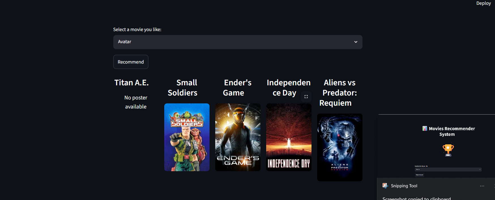

# 🎬 Movie Recommendation System

A content-based Movie Recommendation System built using Python, Pandas, Scikit-learn, and Streamlit. The application recommends similar movies based on movie metadata using NLP techniques and Cosine Similarity.

## 🚀 Features

* Content-based movie recommendations
* Movie poster fetching using TMDB API
* Interactive Streamlit web interface
* Fast and accurate recommendations
* Uses Bag-of-Words and Cosine Similarity

## 🛠️ Tech Stack

* Python
* Pandas
* NumPy
* Scikit-learn
* Streamlit
* TMDB API

## 📂 Project Structure

```text
ML_PROJECT-1/
│
├── screenshots/
│   ├── h1.png
│   └── h2.png
│
├── app.py
├── final_movies.csv
├── final_similarity.csv
├── requirements.txt
└── README.md
```

## 📸 Screenshots

### Home Page


### Movie Recommendations



## ⚙️ Installation

Clone the repository:

```bash
git clone https://github.com/your-username/movie-recommendation-system.git
cd movie-recommendation-system
```

Create a virtual environment:

```bash
python -m venv .venv
```

Activate the environment:

```bash
.venv\Scripts\activate
```

Install dependencies:

```bash
pip install -r requirements.txt
```

## ▶️ Run the Application

```bash
streamlit run app.py
```

## 🎯 How It Works

1. User selects a movie.
2. The system finds similar movies using cosine similarity.
3. TMDB API fetches movie posters.
4. Top recommendations are displayed with posters.

## 📊 Dataset

* TMDB 5000 Movies Dataset

## 👨‍💻 Author

**Ishan Srivastava**
